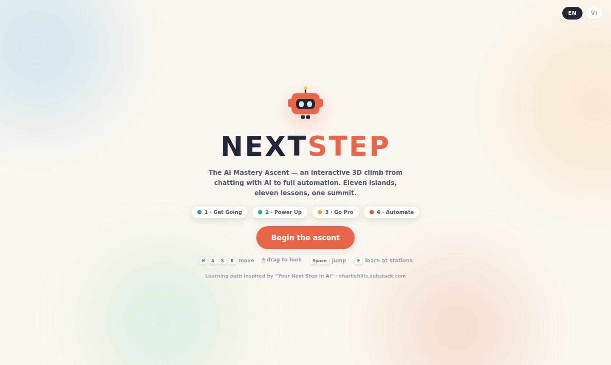
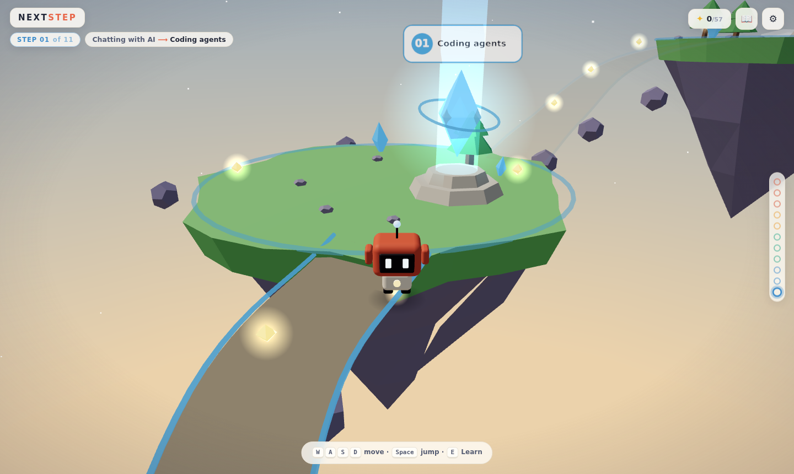
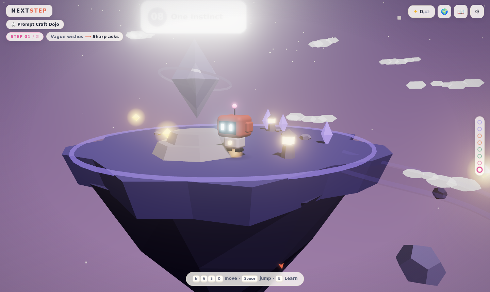
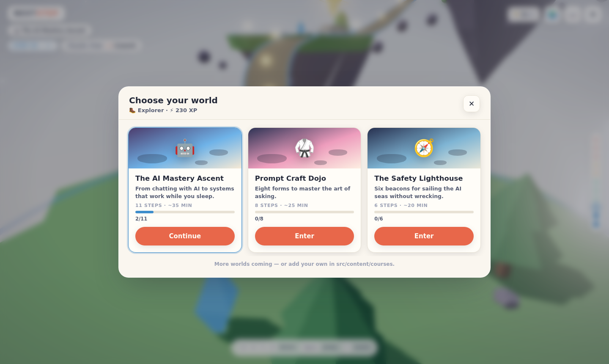
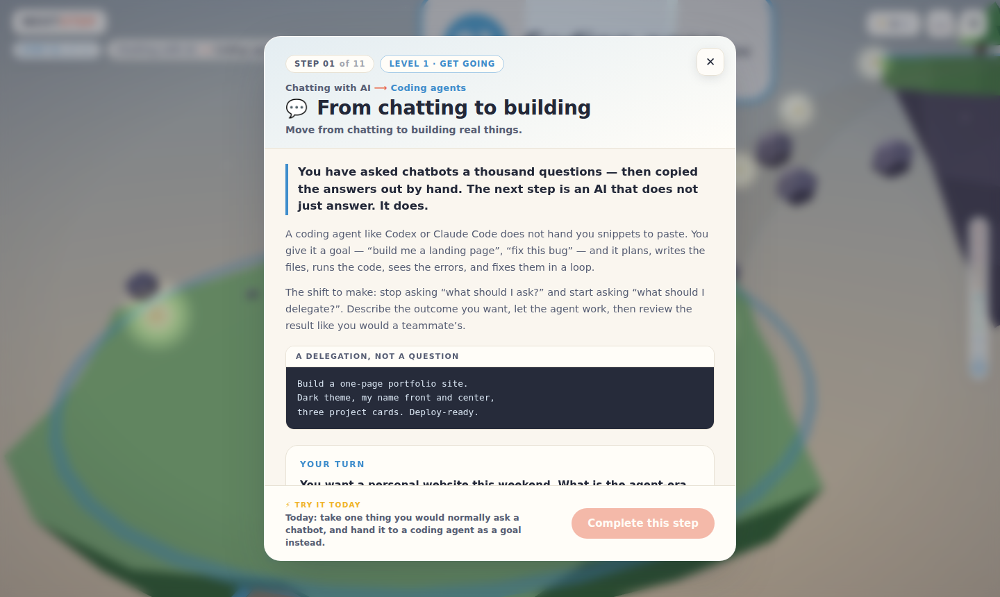
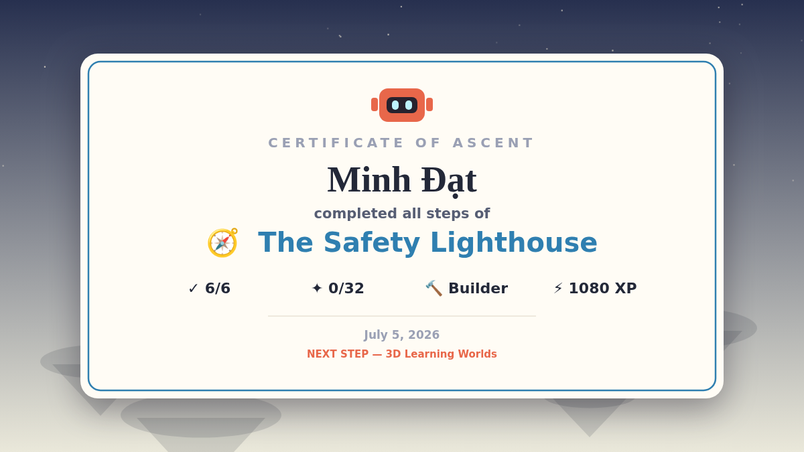

# NEXT STEP — 3D Learning Worlds

An interactive **3D learning platform**: pilot a hover-robot up spirals of
floating islands, where every island is one lesson and every completed
challenge physically opens the path forward.

It ships with **three worlds** (courses), each with its own map, theme,
atmosphere and learning path — and adding a new world is a single data file.

| World | Path | Theme |
| --- | --- | --- |
| 🤖 **The AI Mastery Ascent** (11 steps) | the “Your Next Step in AI” ladder: coding agents → memory → projects → skills → connectors → Claude Code → CLAUDE.md → sub-agents → agent teams → routines | morning blue → violet dusk |
| 🥋 **Prompt Craft Dojo** (8 steps) | the art of asking: specificity, context, few-shot examples, structure, output contracts, thinking room, iteration, diagnosis | sakura dawn → ink-wash night |
| 🧭 **The Safety Lighthouse** (6 steps) | AI's sharp edges: hallucinations, verification, secrets, over-trust, framing bias, the safety ritual | sea fog → beacon night |






## How it plays

- **A rising spiral of floating islands** per world, wound around a central
  beacon. Each island hosts one learning station; sky, fog, terrain and
  decorations blend across the course's themed zones as you ascend.
- **Learn by doing.** Each station opens a compact lesson (hook → concept →
  real example) followed by one of **five interactive challenge engines**:
  scenario quizzes with teaching feedback, multi-select curation, pair
  matching, pipeline sequencing, and a simulated terminal where you actually
  type the command.
- **Progress is physical.** Completing a step turns its crystal gold and
  *materializes the bridge* to the next island.
- **Meta-progression across worlds**: XP for steps (with a perfect-run
  bonus), sparks and course completions; five ranks from Explorer to
  Automator; progress persists per course.
- **Shareable certificate**: finishing a world generates a themed,
  personalized PNG certificate (canvas-drawn, social-card ratio) plus a
  share/copy action — and a confetti summit ceremony.
- **The journal (“field notes”)** collects every finished lesson with its
  *“try it today”* action — the game ends with a practical checklist.
- Fully **bilingual (English / Tiếng Việt)**, switchable at any time.
- Desktop (WASD + mouse) and **touch** (virtual joystick + tap) controls,
  procedural ambient music per zone, quality toggle, `localStorage` saves
  (with automatic v1 → v2 migration).




## Run it

```bash
npm install
npm run dev           # local dev server
npm run build         # type-check + production build → dist/
npm run build:single  # single self-contained HTML file → dist-single/index.html
npm run preview       # serve the production build
```

Deep links: `?course=prompt-dojo`, `?course=safety-lighthouse`.

No API keys, no external assets — geometry, textures, audio and the
certificate are all generated procedurally at runtime.

### Controls

| Input | Action |
| --- | --- |
| `W A S D` / arrows | move |
| mouse drag / right-half touch drag | orbit camera |
| wheel / pinch | zoom |
| `Space` / ⤒ button | jump |
| `E` / tap prompt | learn at a station |
| `Esc` | close panels |

## Adding a new world (course)

Everything — the 3D map, zone atmosphere, ladder HUD, journal, certificate —
derives from one typed definition:

1. Create `src/content/courses/my-course.ts` exporting a `Course`:

```ts
import type { Course } from '../types'

export const MY_COURSE: Course = {
  id: 'my-course',
  icon: '🎓',
  name: { en: 'My Course', vi: 'Khoá học của tôi' },
  tagline: { en: '…', vi: '…' },
  blurb: { en: '…', vi: '…' },
  minutes: 20,
  // named bands of steps → ladder colors + zone mapping
  levels: [
    { name: { en: 'Basics', vi: 'Cơ bản' }, color: '#3e8dcc', steps: [1, 2], zone: 0 },
    { name: { en: 'Advanced', vi: 'Nâng cao' }, color: '#d95b3f', steps: [3, 4], zone: 1 },
  ],
  // atmosphere bands: sky, terrain tint, decoration flavor
  zones: [
    { skyTop: '#6fb3e8', skyBottom: '#f6ead6', grass: '#7ec578', rock: '#8d87a8',
      accent: '#3e8dcc', sun: '#fff3e0', starAlpha: 0, flavor: 'trees' },
    { skyTop: '#4c3d6e', skyBottom: '#ef8f6a', grass: '#8a76a6', rock: '#6b5f88',
      accent: '#d95b3f', sun: '#ffc9a0', starAlpha: 1, flavor: 'lantern' },
  ],
  // spiral geometry of the island chain
  layout: { spiralDeg: 62, radius: 30, rise: 6, islandRadius: 8, startRadius: 10 },
  lessons: [ /* one Lesson per step — see content/types.ts */ ],
}
```

2. Register it in `src/content/courses/index.ts`.

That's it: the world builds itself (one island per lesson), bridges gate the
path, the HUD ladder adopts your level colors, and the certificate uses your
zone palette. Decoration flavors available: `trees`, `bushes`, `shards`,
`sakura`, `bamboo`, `lantern`, `reeds` — new flavors are ~20 lines in
`src/world/islands.ts`.

Each lesson's exercise picks one of five challenge engines (`quiz`, `multi`,
`match`, `order`, `terminal`) — pure data, bilingual by construction, with
instant feedback and retry built in.

## Technology choices (research summary)

| Option | Verdict |
| --- | --- |
| **Three.js + TypeScript + Vite** ✅ | Chosen. ~198 kB gz total, full art direction control, first-class post-processing, ideal for fully procedural art. |
| React Three Fiber + drei | Great DX, but adds React overhead for a game with one imperative main loop; lesson UI is hand-rolled DOM. |
| Babylon.js | Heavier bundle; harder to art-direct toward this soft low-poly look. |
| Unity / Godot Web export | 20–60 MB payloads, slow cold loads — wrong tool for instant-on learning. |
| PlayCanvas | Editor-centric cloud workflow; less suited to a code-first repo. |
| WebGPU / TSL | Promising, WebGL2 still has broader reach; nothing here needs compute. |

Deliberate calls: procedural everything (zero downloads, single-file build via
`vite-plugin-singlefile`), DOM for text-heavy learning content, deterministic
worlds (seeded PRNG), device-aware quality auto-detection.

## Architecture

```
src/
  main.ts               orchestration: course resolution, loop, progression, cinematics
  core/                 engine (renderer+bloom), input (kbd/mouse/touch), audio, save (v2 + migration)
  game/                 constants (lang, PRNG), runtime (course → layout/zones), state (progress, XP, ranks)
  content/
    types.ts            Course / Lesson / Challenge / Rank definitions
    courses/            ai-ladder.ts · prompt-dojo.ts · safety-lighthouse.ts · index.ts (registry)
    i18n.ts             UI strings (EN/VI)
  world/                sky, islands (7 decoration flavors), bridges, stations, beacon, sparks, particles
  player/               robot (procedural mascot), controller (physics), chase camera
  ui/                   hud, lesson modal, challenge engines, screens (worlds hub, journal, settings,
                        completion), certificate (canvas PNG generator)
  styles/main.css       the design system
```

Notable mechanics: edge-guarded walking with wind-catch respawn, gated
traversal (ghost bridges), altitude-blended atmosphere over N zones,
data-driven challenges, and a `window.__game` debug API driving the
Playwright end-to-end suite (course switching, save migration, certificate
download, all three worlds).

---

*AI-ladder learning path inspired by “Your Next Step in AI”
(charliehills.substack.com). Built with Three.js.*
