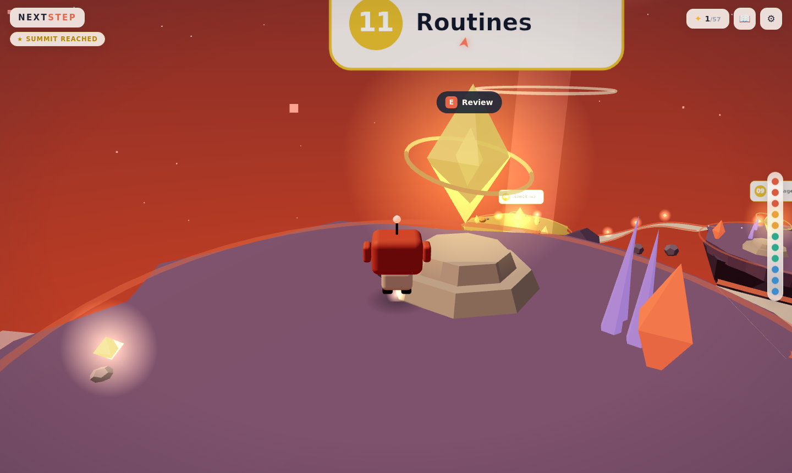

# NEXT STEP — The AI Mastery Ascent

An interactive **3D learning game**: pilot a little hover-robot up a spiral of
floating islands and climb the AI mastery ladder — eleven steps, from *chatting
with AI* to *systems that work while you sleep*.

The learning path is inspired by the infographic
[“Your Next Step in AI”](https://charliehills.substack.com) — the game turns its
eleven rungs (Codex, Memory, Cowork, Projects, Skills, Connectors, Claude Code,
CLAUDE.md, Sub-agents, Agent Team, Routines) into an explorable world where every
step is a place, a lesson, and a hands-on challenge.


## How it plays

- **A rising spiral of 12 floating islands** around a central beacon of light.
  Each island hosts one learning station; the sky shifts from fresh morning blue
  through golden hour to a starry violet dusk as you ascend the four levels
  (*Get Going → Power Up → Go Pro → Automate*) — the same color bands as the
  original ladder.
- **Learn by doing.** Each station opens a compact lesson (hook → concept →
  real example) followed by one of **five interactive challenge engines**:
  - scenario quizzes with teaching feedback on every option,
  - multi-select curation exercises (e.g. *what belongs in Memory / CLAUDE.md?*),
  - pair-matching (connectors ↔ the jobs they unlock),
  - pipeline sequencing (assemble an agent team in working order),
  - a simulated terminal (actually type the slash command to run a skill).
- **Progress is physical.** Completing a step turns its crystal gold and
  *materializes the bridge* to the next island. Collect sparks along the way,
  guided by a light pillar and an edge-of-screen compass.
- **The journal ("field notes")** collects every lesson you finish together with
  its *“try it today”* action — so the game ends with a practical checklist,
  not just a score.
- **Summit ceremony** with a recap of all eleven capabilities once the final
  step is done.
- Fully **bilingual (English / Tiếng Việt)**, switchable at any time.
- Desktop (WASD + mouse) and **touch** (virtual joystick + tap) controls.
- Procedural ambient music and synthesized SFX (WebAudio — zero audio assets).
- Progress persists in `localStorage`.




## Run it

```bash
npm install
npm run dev        # local dev server
npm run build      # type-check + production build → dist/
npm run build:single  # single self-contained HTML file → dist-single/index.html
npm run preview    # serve the production build
```

Requires Node 20+. No API keys, no external assets — everything (geometry,
textures, audio) is generated procedurally at runtime.

### Controls

| Input | Action |
| --- | --- |
| `W A S D` / arrows | move |
| mouse drag / right-half touch drag | orbit camera |
| wheel / pinch | zoom |
| `Space` / ⤒ button | jump |
| `E` / tap prompt | learn at a station |
| `Esc` | close panels |

## Technology choices (research summary)

The brief was a high-quality browser 3D learning game with beautiful UI. Options
evaluated:

| Option | Verdict |
| --- | --- |
| **Three.js + TypeScript + Vite** ✅ | Chosen. Small (≈177 kB gz), total control over look and performance, first-class post-processing (UnrealBloom), mature and stable. Ideal for a fully procedural art style — no asset pipeline needed. |
| React Three Fiber + drei | Great DX, but adds React overhead and indirection for a game that needs one imperative main loop; no UI framework is needed here (lesson UI is hand-rolled DOM, which stays crisper than in-canvas text). |
| Babylon.js | Full engine with more built-ins (physics, GUI), but heavier bundle and a look that is harder to art-direct toward this soft low-poly aesthetic. |
| Unity / Godot Web export | 20–60 MB payloads, slow cold loads, poor DOM/UI integration — wrong tool for an instant-on learning game. |
| PlayCanvas | Editor-centric, cloud workflow; less suited to a code-first, reviewable repository. |
| WebGPU / TSL | Promising, but WebGL2 still has far broader reach in 2026; nothing here needs compute shaders. |

Other deliberate calls:

- **Procedural everything** (islands, robot, textures, music): zero downloads,
  works offline, no licensing, and the whole game fits in one HTML file via
  `vite-plugin-singlefile`.
- **DOM for learning content**: text-heavy lessons render as accessible,
  selectable, responsive HTML on top of the canvas instead of 3D text.
- **Deterministic world** (seeded PRNG) so the world looks identical across
  sessions and screenshots.
- **Quality toggle** (bloom + soft shadows + high DPR ↔ lightweight mode) with
  device-based auto-detection for mobile.

## Architecture

```
src/
  main.ts            game orchestration: loop, progression, cinematics, debug API
  core/              engine (renderer+composer), input (kbd/mouse/touch), audio, save
  game/              constants (layout, palettes, levels), state (progress + events)
  content/           lessons.ts (11 bilingual lessons + challenges), i18n.ts (UI strings)
  world/             sky, islands, bridges, stations, beacon, sparks, particles, textures
  player/            robot (procedural mascot), controller (physics), chase camera
  ui/                hud (chips/ladder/prompts), lesson modal, challenge engines, screens
  styles/main.css    the whole design system (infographic-inspired)
```

Notable mechanics under the hood:

- **Edge-guarded walking**: raycast ground snapping that refuses to walk off a
  cliff (but lets you jump off — the wind catches you and returns you to the
  last safe spot).
- **Gated traversal**: locked bridges are ghost-transparent and excluded from
  the walkable set; completing a step animates them solid and walkable.
- **Altitude-blended atmosphere**: sky shader, fog, hemisphere light, star
  opacity and terrain tint all interpolate across four zone palettes by height.
- **Data-driven challenges**: each lesson declares one of five challenge specs;
  the engines are reusable and bilingual by construction.

## Testing

`window.__game` exposes a small debug API (`teleport`, `openLesson`,
`completeStep`, `skipIntro`) used by the Playwright end-to-end script that
drives the real game: start → move → station → lesson → challenge → step
completion → bridge unlock → summit → language switch.

---

*Learning path inspired by “Your Next Step in AI” (charliehills.substack.com).
Built with Three.js.*
